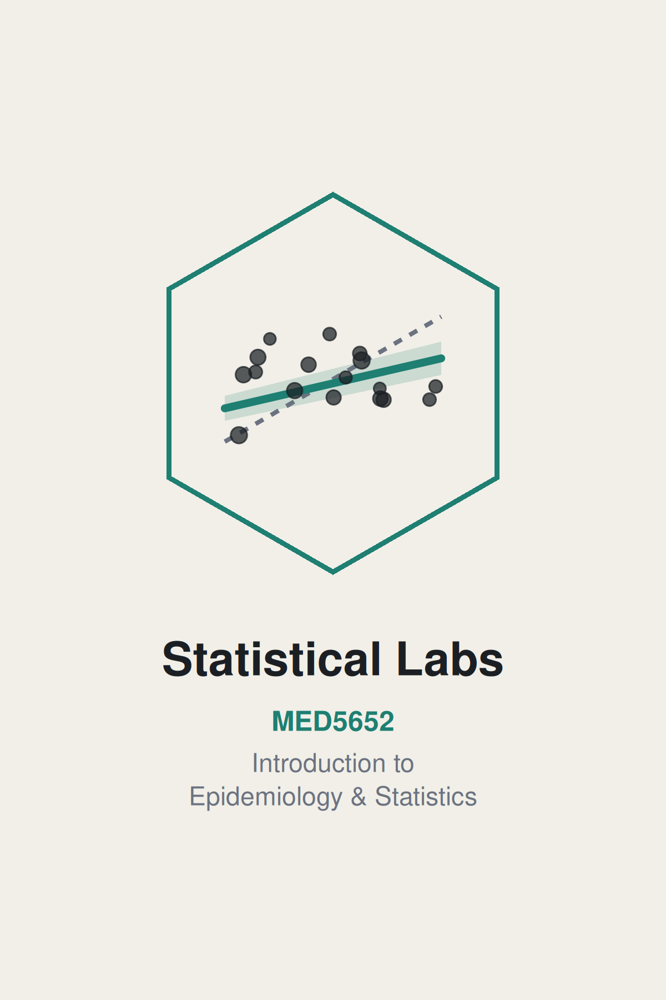

# Introduction {.unnumbered}

::: {.content-visible unless-format="pdf"}
{fig-alt="IES Statistical Labs: MED5652, Introduction to Epidemiology & Statistics" width="58%" fig-align="center"}
:::

## What this book is

This is a companion ebook for the statistical labs of the course MED5652 Introduction to Epidemiology and Statistics for UofG MPH students. The principles and theories of statistics are taught in the seminars. This ebook, and the lab sessions, are to apply that knowledge in epidemiology and statistics to real data using R.

The first two preparatory sessions help us ease into the analysis environment. R is primarily a programming language, so it has a steeper learning curve than software like SPSS: we communicate with the computer using text commands instead of a mouse. It pays that curve back, though. R is versatile enough to find a software implementation for almost any statistical method we might need, and it's a skill employers actively look for. This ebook is set up for complete beginners regardless, with no prior data analysis or programming experience expected. From Chapter 3 on, every chapter picks up from the theories taught in the seminars, but it doesn't replace the seminar's content. Think of the seminar as where an idea is introduced, and the lab as where we actually do it, in R, on real data.

## Where this book sits against the module's outcomes

MED5652 as a whole has four intended learning outcomes. By the end of the course, you will be able to:

1. Critically assess the role of epidemiology and statistics within public health.
2. Critically appraise key concepts in epidemiological design.
3. Critically appraise and apply key statistical methods.
4. Critically appraise and evaluate the concept of causality within public health literature.

This book is built primarily to get us through ILO 3. Along the way, it also touches on ILO 1, to understand how statistics can inform public health, and ILO 4, to explore how we can use statistics to explore causality.

## Structure of the book

Each chapter of this book is one teaching week. The week number is in the chapter title, and the chapters run in week order. Week 6 is reading week and there is no teaching.

Two parts: two preparatory chapters worked through before seminars on statistics, then five weekly chapters, one per statistics week, each following that week's seminar:

| Chapter | Week | What it covers |
|---|---|---|
| 1 | 4 | R and R Studio |
| 2 | 5 | Data and data handling |
| 3 | 7 | Describing and visualising data |
| 4 | 8 | Estimation, precision, and sample size |
| 5 | 9 | Hypothesis tests and measures of association |
| 6 | 10 | Correlation and simple linear regression |
| 7 | 11 | Multiple linear and logistic regression |

All weeks are interconnected, so please attend all classes. Missing one class would mean you lose the foundation of the next, with a knock-on effect on your overall learning. If you really can't attend a class, please make sure you read and work through the relevant chapter in this ebook before the next class.

An appendix at the end of the book, the Glossary, collects every package, function, operator, and statistical term used across all seven chapters, grouped by package, with the chapter each one first appears in.

## Structure of a chapter

Every chapter in this book follows the same structure. A short problem statement frames why the chapter's tools are needed, usually the gap the previous chapter left open, and sets up the chapter's intended learning outcomes and a setup chunk that reads in the data. The content itself is worked through with code and output, building to a full worked example that puts several pieces together at once. Numbered exercises follow, each one tied to a specific ILO. The five weekly chapters end with a writing exercise, a short results-section paragraph rather than just a calculation: the statistics assessment is a structured question and answer, combining analysis with written interpretation, and this is deliberate practice for it. The preparatory chapters (Chapters 1 and 2) work a little differently, with multiple-choice questions instead, aimed at the places R's syntax most often trips people up; Chapter 2 has a small writing exercise as well. Solutions to the numbered exercises, the self-checks, and the writing exercise sit in a collapsed section at the end of every chapter. The five weekly chapters also carry a "Try it yourself" box: a prompt to change one thing in code we've just run and see what happens, with no written answer attached.

## The two datasets

Almost everything in this book runs on one of two datasets. `nhanes_mph` is a curated extract of real health survey data in the US, linked to mortality records. Chapter 2 reads it in for the first time and gets us comfortable with it as data; Chapter 3 introduces it properly and is where it becomes the dataset the rest of the book runs on. `strep_tb`, from the `medicaldata` package, is the 1948 Medical Research Council (MRC) streptomycin trial, a historic randomised controlled trial, used from Chapter 4 onward wherever a binary outcome and a genuine trial design are useful. Both get introduced properly, in context, the first time that matters.

## Boundary of the ebook/IES course

This book gets you to a working, applied foundation in statistics for an MPH graduate. It is not a complete statistics education. Several real, common techniques will not be covered. Our data carry a death indicator and a follow-up time, for instance, and Chapter 7 uses them to build a fixed-window mortality outcome. However, such data would be better analysed using survival analysis techniques, which will only be covered in the Advanced Statistics course. Testing for mediation, moderation/interaction, and choosing between competing regression models are all left out too. Treat every one of those signposts as a real boundary, not a gap in this book you're expected to fill in yourself. Chapter 7 closes with a (non-exhaustive) list of statistics techniques that are common in public health but not covered here, so you know what is out there.

## How to use the ebook

The best thing to do is to work through the corresponding chapter before you come to the lab. Very likely you will encounter some errors you can't fix, or exercises you can't complete. The lab will be particularly useful to help you with these. The lab will also include demonstration of some key commands but will not be able to cover all the details in this ebook.

When you work on the ebook, attempt the exercises yourself before you open the solutions. Work along in a script of your own as you go, as taught in Chapter 2. Keep this book open for the rest of the programme. It stays the reference you come back to whenever you need a reminder of how something works. If a function's name is only half-remembered, the Glossary at the end is the place to look it up.
